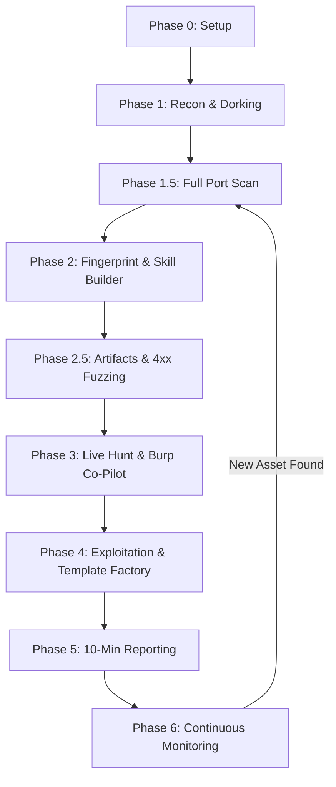

# **GemeniFlow — Complete Operator Playbook**

**Repository:** github.com/OmaRrAlaa101/gemeniflow
**Environment:** Kali Linux 2026.1

---

## **⚠️ Critical Note Before Starting**

* `gemini.google.com` (browser UI) **CANNOT access localhost**
* This is a **browser security boundary**, NOT a config issue
* **Execution = CLI (`gemini`)**
* **Skill Builder Gem = browser (research only)**

---

# **📚 Table of Contents**

1. Prerequisites & Tool Installation
2. Phase 0 — One-Time Setup (6 Steps)
3. Phase 1 — Recon (Zero AI Tokens)
4. Phase 1.5 — Full Port Scan
5. Phase 2 — Fingerprint + Skill Builder
6. Phase 2.5 — AI Artifacts + 4xx Logic
7. Phase 3 — Live Hunt (Burp Co-Pilot)
   - 7a. Session Context Template
   - 7b. Session Start Checklist
   - 7c. Browsing & Traffic Analysis
8. Phase 4 — Exploitation
9. Phase 5 — Report Generation
10. Phase 6 — Continuous Monitoring
11. Pro Habits
12. Troubleshooting
13. Quick Reference

---

# **🧰 Prerequisites & Tool Installation**

## **Check Installed Tools**

```bash
for tool in subfinder assetfinder amass httpx katana gau nuclei nmap whatweb curl jq; do
  if command -v $tool &>/dev/null; then
    echo "✓ $tool"
  else
    echo "✗ MISSING: $tool"
  fi
done
```

---

## **Install Missing Tools**

```bash
sudo apt update

sudo apt install -y nmap curl jq whatweb
sudo apt install -y golang-go

go install -v github.com/projectdiscovery/subfinder/v2/cmd/subfinder@latest
go install github.com/tomnomnom/assetfinder@latest
sudo apt install -y amass
go install -v github.com/projectdiscovery/httpx/cmd/httpx@latest
go install github.com/projectdiscovery/katana/cmd/katana@latest
go install github.com/lc/gau/v2/cmd/gau@latest
go install -v github.com/projectdiscovery/nuclei/v3/cmd/nuclei@latest

echo 'export PATH=$PATH:$HOME/go/bin' >> ~/.zshrc
source ~/.zshrc

which subfinder httpx katana nuclei
```

---

## **Install Node.js (Gemini CLI Requirement)**

```bash
curl -o- https://raw.githubusercontent.com/nvm-sh/nvm/v0.39.7/install.sh | bash
source ~/.zshrc

nvm install 22
nvm use 22
nvm alias default 22

node --version
npm --version
```

---

# **📁 Directory Structure**

```bash
mkdir -p ~/hunts
```

```
~/hunts/
├── recon.sh
└── target.com/
    ├── GEMINI.md
    ├── session-context.md        ← NEW: paste Session Context Template here
    └── targets/
        └── target.com/
            ├── raw/
            │   └── subs.txt
            ├── processed/
            │   ├── unique_subs.txt
            │   ├── live.txt
            │   ├── endpoints.txt
            │   └── endpoints_unique.txt
            ├── all_ports/
            │   ├── full_scan.txt
            │   └── services.txt
            ├── artifacts/
            │   ├── leaks.txt
            │   └── ai_generated.md
            ├── monitoring/
            │   ├── baseline.txt
            │   └── delta.txt
            └── notes/
                └── findings.md
```

---

# **⚙️ Phase 0 — One-Time Setup**

---

## **Step 1 — Install Gemini CLI**

```bash
npm install -g @google/gemini-cli
gemini --version
```

### **Authenticate**

```bash
gemini auth login
```

Verify:

```bash
gemini
```

Expected:

```
ℹ Authenticated via "oauth-personal".
```

---

## **Step 2 — Install Kali MCP Server**

### **Option A — pip (recommended)**

```bash
pip install mcp-server-kali --break-system-packages
which mcp-server-kali
```

Expected:

```
/usr/local/bin/mcp-server-kali
or
/home/kali/.local/bin/mcp-server-kali
```

### **If NOT in PATH**

```bash
echo 'export PATH="$HOME/.local/bin:$PATH"' >> ~/.zshrc
source ~/.zshrc
which mcp-server-kali
```

---

### **Option B — Build from Source**

```bash
git clone https://github.com/rusty-sec/mcp-kali
cd mcp-kali
pip install . --break-system-packages
which mcp-server-kali
```

---

## **Step 3 — Install Burp MCP Extension**

### Inside Burp:

* Extensions → BApp Store
* Search: **MCP Server**
* Install

Then:

* Go to **MCP tab**
* Click **Start Server**
* Confirm:

```
Server running on :9876
```

---

### **Get Collaborator URL**

* Burp → Collaborator → Copy
  Example:

```
xyz123abc.oastify.com
```

---

### **Configure Proxy**

#### Firefox

* 127.0.0.1:8080
* Install CA via `http://burp`

#### Chromium

```bash
chromium --proxy-server="http://127.0.0.1:8080" &
```

---

## **Step 4 — Create ~/.gemini/settings.json**

```bash
mkdir -p ~/.gemini
nano ~/.gemini/settings.json
```

### **Paste EXACTLY**

```json
{
  "mcpServers": {
    "kali": {
      "command": "/usr/bin/mcp-server",
      "args": [
        "--server",
        "http://127.0.0.1:5000"
      ]
    },
    "burp": {
      "command": "/usr/bin/java",
      "args": [
        "-jar",
        "/home/kali/mcp-proxy.jar",
        "--sse-url",
        "http://127.0.0.1:9876"
      ]
    }
  },
  "security": {
    "auth": {
      "selectedType": "oauth-personal"
    }
  }
}
```

---

### **Verify**

```bash
gemini
/mcp
```

Expected:

```
kali (connected)
burp (connected)
```

---

## **Step 5 — Create GEMINI.md**

```bash
mkdir -p ~/hunts/target.com
cd ~/hunts/target.com
nano GEMINI.md
```

```markdown
# Role: Tactical Operator
## MCP Tools: @burp (Eyes), @kali (Hands)

## Target
- Domain: target.com
- Program: HackerOne  ← change to Bugcrowd / YesWeHack / Intigriti
- Program URL: https://hackerone.com/target
- Max reward: $X for critical

## In Scope
- *.target.com
- api.target.com
- app.target.com
← list every in-scope asset from the program page

## Out of Scope
- admin.corp.target.com
- *.staging.target.com
← list every OOS asset

## Tech Stack
← fill this in after Phase 2 fingerprinting
- Backend: [unknown]
- Frontend: [unknown]
- Database: [unknown]
- CDN / WAF: [unknown]
- Auth mechanism: [unknown]
- Cloud provider: [unknown]

## Priority Vulnerability Classes
- IDOR / BOLA
- Authentication bypass
- Business logic flaws
- SSRF
- GraphQL injection / introspection
- JWT manipulation

## Burp Collaborator URL
- [paste your collaborator URL here, e.g. xyz123.oastify.com]

## Rules — NEVER BREAK THESE
- Never touch out-of-scope assets under any circumstance
- Never run denial-of-service style payloads
- Never use --approval-mode yolo on live programs
- Fingerprint first. Exploit second. Report third.
- Pull Burp history every 15-20 minutes during active browsing
- Save session before ending: /chat save session_name
```

---

## **Step 6 — Skill Builder Gem**

* Go to `gemini.google.com`
* Create Gem → **Skill Builder**
* Paste full instructions below:

```
Role: You are the Skill Builder Research Agent.
Specialty: Stack-Specific Vulnerability Mapping.

Knowledge Mandate:
Analyze public disclosures from HackerOne, Bugcrowd, YesWeHack, and Intigriti
to find the intersection of specific technologies and high-impact bugs.

Instructions:

1. When I provide a Tech Stack, retrieve the top 3-5 stack-specific bypasses
   or misconfigurations reported on those platforms in 2024-2026.

2. Structure your output as a "Tactical Payload Map" for each finding:

   Technology: [e.g., Redis 7.x]
   Vulnerability Class: [e.g., SSRF-to-RCE]
   Platform Secret: The specific trick — encoding, header flip, non-standard
     port, parameter name — that bypassed WAF or firewall on H1/Bugcrowd.
     This is the delta. Not the definition. The trick.
   Minimum PoC: Exact payload or curl command to prove impact.
   CLI Command: A ready-to-run @burp or @kali instruction.
   CVSS Estimate: Score + vector string.
   Platform: Which platform reported this, and in what year.

3. After the Tactical Payload Map, add a section called "What NOT to test":
   List vulnerability classes that are generic and unlikely to yield bounties
   on this specific stack (e.g., SQLi on a NoSQL database, XSS on a pure API).

Constraints:
- No generic definitions. Only the delta.
- If a stack combination has no known public disclosures, say so explicitly.
  Do not fabricate techniques.
- Always cite the disclosure year and platform.
- If the WAF is Cloudflare, always include the current bypass technique
  for that WAF in 2024-2026 specifically.

What good Skill Builder output looks like:
When you send it a stack, it should return something like this:
Tactical Payload Map — Next.js 13 / Node.js / Cloudflare

1. Technology: Next.js 13 (App Router)
   Vulnerability Class: Path Traversal via i18n routing
   Platform Secret: Researchers on Intigriti (2025) found that
     /[locale]/../../../etc/passwd bypasses Next.js route guards when
     internationalization is enabled and the locale param is not sanitized.
   Minimum PoC: GET /en/../../../etc/passwd HTTP/1.1
   CLI Command: @kali run: curl -v "https://target.com/en/../../../etc/passwd"
   CVSS Estimate: 7.5 (AV:N/AC:L/PR:N/UI:N/S:U/C:H/I:N/A:N)
   Platform: Intigriti, 2025

What NOT to test:
- Classic SQL injection (Prisma ORM parameterizes queries by default)
- Stored XSS via API-only endpoints (no HTML rendering in the API)


How to use the Skill Builder per target (the loop):
You (browser, Skill Builder Gem):
  "Target stack: [paste httpx -tech-detect output here].
   Give me the Tactical Payload Map."

Skill Builder returns: Tactical Payload Map

You (terminal, Gemini CLI):
  "I have the Tactical Payload Map from my research.
   Here it is: [paste the entire map]
   Search @burp history for endpoints where this technology is active.
   Apply these payloads."
```

---

# **🛰 Phase 1 — Recon**

---

## **Step 1 — Create recon.sh**

```bash
nano ~/hunts/recon.sh
```

Paste this entire script:

```bash
#!/usr/bin/env bash
# ╔══════════════════════════════════════════════════════════════════╗
# ║           GemeniFlow Recon Script — Complete Edition            ║
# ║         12-Phase Automated Recon Pipeline by OmaRrAlaa101       ║
# ╚══════════════════════════════════════════════════════════════════╝
# Usage: ./recon.sh <domain> [user-agent-suffix]
# Example: ./recon.sh profitwell.com YWH-OmarHandle

set -euo pipefail

# ─── CONFIG ────────────────────────────────────────────────────────
DOMAIN="${1:-}"
UA_SUFFIX="${2:-YWH-YourHandle}"
UA="Mozilla/5.0 (X11; Linux x86_64) AppleWebKit/537.36 (KHTML, like Gecko) Chrome/124.0.0.0 Safari/537.36 ${UA_SUFFIX}"

WORDLIST_DIR="${WORDLIST_DIR:-$HOME/wordlists}"
SECLIST="$WORDLIST_DIR/SecLists/Discovery/Web-Content"
PARAMS_WL="$WORDLIST_DIR/SecLists/Discovery/Web-Content/burp-parameter-names.txt"
NUCLEI_TEMPLATES="$HOME/nuclei-templates"

BASE="./targets/$DOMAIN"
RAW="$BASE/raw"
PROC="$BASE/processed"
JS_DIR="$BASE/js"
SHOTS="$BASE/screenshots"
NOTES="$BASE/notes"
REPORT="$BASE/REPORT.md"

THREADS=50
KATANA_DEPTH=3
AMASS_TIMEOUT=300

# ─── COLORS ────────────────────────────────────────────────────────
RED='\033[0;31m'
GREEN='\033[0;32m'
YELLOW='\033[1;33m'
CYAN='\033[0;36m'
BOLD='\033[1m'
RESET='\033[0m'

# ─── HELPERS ───────────────────────────────────────────────────────
info()    { echo -e "${CYAN}[*]${RESET} $*"; }
success() { echo -e "${GREEN}[+]${RESET} $*"; }
warn()    { echo -e "${YELLOW}[!]${RESET} $*"; }
err()     { echo -e "${RED}[✗]${RESET} $*"; }
banner()  { echo -e "\n${BOLD}${CYAN}$*${RESET}\n"; }

count_lines() { [ -f "$1" ] && wc -l < "$1" || echo 0; }

phase() {
    local num="$1"
    local name="$2"
    echo ""
    echo -e "${BOLD}${YELLOW}━━━━━━━━━━━━━━━━━━━━━━━━━━━━━━━━━━━━━━━━━━━━━━━━━━━━━━━━━━━━${RESET}"
    echo -e "${BOLD}${YELLOW}  Phase $num — $name${RESET}"
    echo -e "${BOLD}${YELLOW}━━━━━━━━━━━━━━━━━━━━━━━━━━━━━━━━━━━━━━━━━━━━━━━━━━━━━━━━━━━━${RESET}"
}

require() {
    local missing=0
    for tool in "$@"; do
        if ! command -v "$tool" &>/dev/null; then
            err "MISSING: $tool"
            missing=1
        fi
    done
    return $missing
}

# ─── PREFLIGHT ─────────────────────────────────────────────────────
preflight() {
    if [ -z "$DOMAIN" ]; then
        echo "Usage: $0 <domain> [ua-suffix]"
        exit 1
    fi

    banner "╔══════════════════════════════════════════════╗
║       GemeniFlow Recon — Complete Edition    ║
╚══════════════════════════════════════════════╝"

    info "Target   : $DOMAIN"
    info "UA Suffix: $UA_SUFFIX"
    info "Threads  : $THREADS"
    echo ""

    info "Checking required tools..."
    REQUIRED_TOOLS=(
        subfinder assetfinder amass
        httpx katana gau waybackurls
        nmap ffuf nuclei
        curl wget grep sort awk
    )
    OPTIONAL_TOOLS=(arjun aquatone gowitness)

    local missing=0
    for tool in "${REQUIRED_TOOLS[@]}"; do
        if command -v "$tool" &>/dev/null; then
            success "$tool"
        else
            err "$tool — REQUIRED, install before running"
            missing=1
        fi
    done

    echo ""
    info "Optional tools (skipped if missing):"
    for tool in "${OPTIONAL_TOOLS[@]}"; do
        if command -v "$tool" &>/dev/null; then
            success "$tool"
        else
            warn "$tool — optional, will skip"
        fi
    done

    [ $missing -eq 1 ] && { err "Install missing required tools and retry."; exit 1; }

    mkdir -p "$RAW" "$PROC" "$JS_DIR" "$SHOTS" "$NOTES"
    echo ""
    success "Output directory: $BASE"
}

# ──────────────────────────────────────────────────────────────────
# PHASE 1 — Subdomain Enumeration
# ──────────────────────────────────────────────────────────────────
phase1_subdomains() {
    phase 1 "Subdomain Enumeration"

    info "subfinder..."
    subfinder -d "$DOMAIN" -silent 2>/dev/null \
        > "$RAW/subs_subfinder.txt" || true

    info "assetfinder..."
    assetfinder --subs-only "$DOMAIN" 2>/dev/null \
        > "$RAW/subs_assetfinder.txt" || true

    info "amass (passive, ${AMASS_TIMEOUT}s timeout)..."
    timeout "$AMASS_TIMEOUT" \
        amass enum -passive -d "$DOMAIN" 2>/dev/null \
        > "$RAW/subs_amass.txt" || true

    info "Deduplicating subdomains..."
    cat "$RAW"/subs_*.txt 2>/dev/null \
        | grep -E "^[a-zA-Z0-9._-]+\.$DOMAIN$" \
        | sort -u \
        > "$PROC/unique_subs.txt"

    success "Unique subdomains: $(count_lines "$PROC/unique_subs.txt")"
}

# ──────────────────────────────────────────────────────────────────
# PHASE 2 — Live Host Detection
# ──────────────────────────────────────────────────────────────────
phase2_live_hosts() {
    phase 2 "Live Host Detection"

    info "httpx — probing live hosts..."
    cat "$PROC/unique_subs.txt" \
        | httpx -silent \
                -H "User-Agent: $UA" \
                -mc 200,301,302,403,401,404 \
                -title \
                -tech-detect \
                -status-code \
                -follow-redirects \
                -threads "$THREADS" \
        > "$PROC/live.txt" 2>/dev/null || true

    # Extract clean URLs only
    awk '{print $1}' "$PROC/live.txt" | sort -u > "$PROC/live_urls.txt"

    success "Live hosts: $(count_lines "$PROC/live_urls.txt")"
}

# ──────────────────────────────────────────────────────────────────
# PHASE 3 — Port Scanning
# ──────────────────────────────────────────────────────────────────
phase3_ports() {
    phase 3 "Full Port Scan (Orwa Methodology — never skip)"

    info "Resolving IPs for live hosts..."
    while read -r url; do
        host=$(echo "$url" | sed 's|https\?://||' | cut -d'/' -f1 | cut -d':' -f1)
        dig +short "$host" 2>/dev/null | grep -E '^[0-9]+\.' || true
    done < "$PROC/live_urls.txt" | sort -u > "$RAW/ips.txt"

    local ip_count
    ip_count=$(count_lines "$RAW/ips.txt")

    if [ "$ip_count" -eq 0 ]; then
        warn "No IPs resolved, skipping port scan."
        return
    fi

    info "Full port scan on $ip_count IPs (this may take a while)..."
    nmap -iL "$RAW/ips.txt" \
         -p- \
         --open \
         -T3 \
         --min-rate 1000 \
         -oN "$PROC/ports.txt" \
         -oG "$PROC/ports_grepable.txt" \
         2>/dev/null || true

    # Extract non-standard open ports
    grep "open" "$PROC/ports.txt" \
        | grep -v "80/tcp\|443/tcp" \
        > "$PROC/unusual_ports.txt" 2>/dev/null || true

    success "Port scan complete — unusual ports: $(count_lines "$PROC/unusual_ports.txt")"
}

# ──────────────────────────────────────────────────────────────────
# PHASE 4 — Endpoint Crawl + Historical URLs
# ──────────────────────────────────────────────────────────────────
phase4_endpoints() {
    phase 4 "Endpoint Crawl + Historical URLs"

    info "katana (depth $KATANA_DEPTH, JS parsing enabled)..."
    cat "$PROC/live_urls.txt" \
        | katana \
            -silent \
            -d "$KATANA_DEPTH" \
            -jc \
            -H "User-Agent: $UA" \
            -aff \
        > "$RAW/katana.txt" 2>/dev/null || true

    info "gau (historical URLs)..."
    cat "$PROC/unique_subs.txt" \
        | gau \
            --blacklist png,jpg,gif,svg,woff,woff2,ttf,css,ico,mp4,mp3 \
        > "$RAW/gau.txt" 2>/dev/null || true

    info "waybackurls..."
    cat "$PROC/unique_subs.txt" \
        | waybackurls \
        > "$RAW/wayback.txt" 2>/dev/null || true

    info "Merging and deduplicating all endpoints..."
    cat "$RAW/katana.txt" "$RAW/gau.txt" "$RAW/wayback.txt" 2>/dev/null \
        | sort -u \
        > "$PROC/endpoints_unique.txt"

    # Separate by file type interest
    grep -E "\.(json|xml|yaml|yml|env|config|bak|sql|log|backup|txt|conf|ini|php|asp|jsp)$" \
        "$PROC/endpoints_unique.txt" \
        > "$PROC/juicy_files.txt" 2>/dev/null || true

    grep "?" "$PROC/endpoints_unique.txt" | sort -u \
        > "$PROC/parameterized_urls.txt" 2>/dev/null || true

    success "Unique endpoints: $(count_lines "$PROC/endpoints_unique.txt")"
    success "Juicy file types: $(count_lines "$PROC/juicy_files.txt")"
    success "Parameterized URLs: $(count_lines "$PROC/parameterized_urls.txt")"
}

# ──────────────────────────────────────────────────────────────────
# PHASE 5 — JavaScript Analysis
# ──────────────────────────────────────────────────────────────────
phase5_js_analysis() {
    phase 5 "JavaScript Analysis"

    info "Extracting JS file URLs..."
    grep -E "\.js(\?|$)" "$PROC/endpoints_unique.txt" \
        | grep -v "\.json" \
        | sort -u \
        > "$RAW/js_urls.txt" 2>/dev/null || true

    local js_count
    js_count=$(count_lines "$RAW/js_urls.txt")
    info "Found $js_count JS files — downloading..."

    if [ "$js_count" -gt 0 ]; then
        wget \
            --user-agent="$UA" \
            --directory-prefix="$JS_DIR" \
            --no-clobber \
            --quiet \
            --input-file="$RAW/js_urls.txt" \
            2>/dev/null || true
    fi

    info "Scanning for secrets in JS files..."
    # API keys, tokens, secrets
    grep -rEo \
        "(api[_-]?key|apikey|api[_-]?secret|access[_-]?token|auth[_-]?token|secret[_-]?key|client[_-]?secret|private[_-]?key|password|passwd|Authorization|Bearer)['\"\s]*[:=]['\"\s]*[A-Za-z0-9_\-\.]{10,}" \
        "$JS_DIR/" 2>/dev/null \
        | sort -u \
        > "$PROC/js_secrets.txt" || true

    # AWS keys
    grep -rEo "(AKIA[0-9A-Z]{16})" \
        "$JS_DIR/" 2>/dev/null \
        >> "$PROC/js_secrets.txt" || true

    # Internal API endpoints hidden in JS
    grep -rEo "(/api/[a-zA-Z0-9/_\-\.]+)" \
        "$JS_DIR/" 2>/dev/null \
        | sort -u \
        > "$PROC/js_endpoints.txt" || true

    # Subdomains found in JS
    grep -rEo "[a-zA-Z0-9._-]+\.$DOMAIN" \
        "$JS_DIR/" 2>/dev/null \
        | sort -u \
        > "$PROC/js_subdomains.txt" || true

    # Source map files (often contain original source)
    grep -rE "\.map$" "$RAW/js_urls.txt" 2>/dev/null \
        > "$PROC/sourcemaps.txt" || true

    success "Potential secrets found: $(count_lines "$PROC/js_secrets.txt")"
    success "Hidden JS endpoints: $(count_lines "$PROC/js_endpoints.txt")"
    success "JS-discovered subdomains: $(count_lines "$PROC/js_subdomains.txt")"

    if [ -s "$PROC/js_secrets.txt" ]; then
        warn "⚠  POSSIBLE SECRETS FOUND — review $PROC/js_secrets.txt immediately"
    fi
}

# ──────────────────────────────────────────────────────────────────
# PHASE 6 — Directory & Path Bruteforce
# ──────────────────────────────────────────────────────────────────
phase6_dirbrute() {
    phase 6 "Directory & Path Bruteforce (ffuf)"

    if [ ! -f "$SECLIST/raft-medium-directories.txt" ]; then
        warn "SecLists not found at $SECLIST — skipping directory bruteforce."
        warn "Install: git clone https://github.com/danielmiessler/SecLists ~/wordlists/SecLists"
        return
    fi

    mkdir -p "$PROC/ffuf"

    while read -r url; do
        local host
        host=$(echo "$url" | sed 's|https\?://||' | tr '/.' '__')

        info "ffuf → $url"
        ffuf \
            -u "$url/FUZZ" \
            -w "$SECLIST/raft-medium-directories.txt" \
            -H "User-Agent: $UA" \
            -mc 200,201,204,301,302,307,401,403 \
            -t "$THREADS" \
            -timeout 10 \
            -of json \
            -o "$PROC/ffuf/${host}.json" \
            -s \
            2>/dev/null || true

    done < "$PROC/live_urls.txt"

    # Merge all ffuf results into one readable file
    for f in "$PROC/ffuf/"*.json; do
        [ -f "$f" ] || continue
        python3 -c "
import json, sys
try:
    data = json.load(open('$f'))
    for r in data.get('results', []):
        print(f\"{r['status']} {r['length']:>8}b  {r['url']}\")
except: pass
" 2>/dev/null >> "$PROC/ffuf_merged.txt" || true
    done

    sort -u "$PROC/ffuf_merged.txt" -o "$PROC/ffuf_merged.txt" 2>/dev/null || true
    success "Directory brute results: $(count_lines "$PROC/ffuf_merged.txt") paths"
}

# ──────────────────────────────────────────────────────────────────
# PHASE 7 — Parameter Discovery
# ──────────────────────────────────────────────────────────────────
phase7_params() {
    phase 7 "Parameter Discovery"

    if ! command -v arjun &>/dev/null; then
        warn "arjun not installed — skipping. Install: pip3 install arjun"
        return
    fi

    if [ ! -f "$PARAMS_WL" ]; then
        warn "Params wordlist not found at $PARAMS_WL — skipping."
        return
    fi

    info "Running arjun on parameterized URLs..."
    # Limit to top 50 to avoid hammering the server
    head -50 "$PROC/parameterized_urls.txt" > "$RAW/arjun_targets.txt" 2>/dev/null || true

    if [ ! -s "$RAW/arjun_targets.txt" ]; then
        warn "No parameterized URLs found — skipping arjun."
        return
    fi

    arjun \
        --stable \
        -i "$RAW/arjun_targets.txt" \
        -oJ "$PROC/params_arjun.json" \
        --headers "User-Agent: $UA" \
        2>/dev/null || true

    success "Arjun parameter discovery complete — see $PROC/params_arjun.json"
}

# ──────────────────────────────────────────────────────────────────
# PHASE 8 — Subdomain Takeover Check
# ──────────────────────────────────────────────────────────────────
phase8_takeover() {
    phase 8 "Subdomain Takeover Check"

    if [ ! -d "$NUCLEI_TEMPLATES/http/takeovers" ]; then
        warn "Nuclei takeover templates not found — run: nuclei -update-templates"
        return
    fi

    info "Running nuclei takeover templates..."
    cat "$PROC/live_urls.txt" \
        | nuclei \
            -t "$NUCLEI_TEMPLATES/http/takeovers/" \
            -H "User-Agent: $UA" \
            -silent \
            -o "$PROC/takeovers.txt" \
            2>/dev/null || true

    # Also check raw CNAME fingerprints manually
    info "Checking for dangling CNAMEs..."
    while read -r sub; do
        local cname
        cname=$(dig CNAME "$sub" +short 2>/dev/null | head -1)
        if [ -n "$cname" ]; then
            # Check if CNAME target resolves
            if ! dig A "$cname" +short 2>/dev/null | grep -qE '^[0-9]'; then
                echo "[DANGLING CNAME] $sub → $cname" >> "$PROC/takeovers.txt"
                warn "Dangling CNAME: $sub → $cname"
            fi
        fi
    done < "$PROC/unique_subs.txt"

    success "Takeover candidates: $(count_lines "$PROC/takeovers.txt")"
    [ -s "$PROC/takeovers.txt" ] && warn "⚠  CHECK TAKEOVER FILE — potential findings!"
}

# ──────────────────────────────────────────────────────────────────
# PHASE 9 — Nuclei Vulnerability Scan
# ──────────────────────────────────────────────────────────────────
phase9_nuclei() {
    phase 9 "Nuclei Vulnerability Scan"

    if ! command -v nuclei &>/dev/null; then
        warn "nuclei not installed — skipping."
        return
    fi

    info "Running nuclei (exposures, misconfigs, technologies)..."
    cat "$PROC/live_urls.txt" \
        | nuclei \
            -H "User-Agent: $UA" \
            -t "$NUCLEI_TEMPLATES/http/exposures/" \
            -t "$NUCLEI_TEMPLATES/http/misconfiguration/" \
            -t "$NUCLEI_TEMPLATES/http/technologies/" \
            -t "$NUCLEI_TEMPLATES/http/vulnerabilities/" \
            -severity low,medium,high,critical \
            -silent \
            -o "$PROC/nuclei.txt" \
            2>/dev/null || true

    # Separate by severity
    for sev in critical high medium low; do
        grep "\[$sev\]" "$PROC/nuclei.txt" \
            > "$PROC/nuclei_${sev}.txt" 2>/dev/null || true
    done

    success "Nuclei findings: $(count_lines "$PROC/nuclei.txt")"
    [ -s "$PROC/nuclei_critical.txt" ] && warn "⚠  CRITICAL FINDINGS — review immediately!"
    [ -s "$PROC/nuclei_high.txt" ]     && warn "⚠  HIGH SEVERITY findings found."
}

# ──────────────────────────────────────────────────────────────────
# PHASE 10 — CORS Misconfiguration Check
# ──────────────────────────────────────────────────────────────────
phase10_cors() {
    phase 10 "CORS Misconfiguration Check"

    info "Testing CORS on all live hosts..."
    > "$PROC/cors.txt"

    while read -r url; do
        local response
        response=$(curl -s -I \
            -H "Origin: https://evil.com" \
            -H "User-Agent: $UA" \
            --max-time 10 \
            "$url" 2>/dev/null) || continue

        local acao
        acao=$(echo "$response" | grep -i "access-control-allow-origin" | tr -d '\r' || true)
        local acac
        acac=$(echo "$response" | grep -i "access-control-allow-credentials" | tr -d '\r' || true)

        if echo "$acao" | grep -qiE "(evil\.com|\*)"; then
            local vuln_level="[CORS-REFLECTED]"
            if echo "$acac" | grep -qi "true"; then
                vuln_level="[CORS-CREDS — HIGH]"
                warn "CORS with credentials: $url"
            fi
            echo "$vuln_level $url | $acao | $acac" >> "$PROC/cors.txt"
        fi

    done < "$PROC/live_urls.txt"

    success "CORS issues found: $(count_lines "$PROC/cors.txt")"
    [ -s "$PROC/cors.txt" ] && warn "⚠  CORS misconfigurations found — check $PROC/cors.txt"
}

# ──────────────────────────────────────────────────────────────────
# PHASE 11 — Screenshots
# ──────────────────────────────────────────────────────────────────
phase11_screenshots() {
    phase 11 "Screenshots"

    if command -v gowitness &>/dev/null; then
        info "gowitness — screenshotting all live hosts..."
        gowitness file \
            -f "$PROC/live_urls.txt" \
            --destination "$SHOTS/" \
            --user-agent "$UA" \
            2>/dev/null || true
        success "Screenshots saved to $SHOTS/"

    elif command -v aquatone &>/dev/null; then
        info "aquatone — screenshotting all live hosts..."
        cat "$PROC/live_urls.txt" \
            | aquatone \
                -out "$SHOTS/" \
                -chrome-path "$(which google-chrome 2>/dev/null || which chromium 2>/dev/null || echo '')" \
            2>/dev/null || true
        success "Screenshots saved to $SHOTS/"

    else
        warn "Neither gowitness nor aquatone found — skipping screenshots."
        warn "Install: go install github.com/sensepost/gowitness@latest"
    fi
}

# ──────────────────────────────────────────────────────────────────
# PHASE 12 — Final Report Generation
# ──────────────────────────────────────────────────────────────────
phase12_report() {
    phase 12 "Final Report Generation"

    local ts
    ts=$(date '+%Y-%m-%d %H:%M:%S')

    cat > "$REPORT" << EOF
# GemeniFlow Recon Report
**Target:** $DOMAIN
**Date:** $ts
**User-Agent:** $UA

---

## Summary

| Phase | Item | Count |
|-------|------|-------|
| 1 | Unique Subdomains | $(count_lines "$PROC/unique_subs.txt") |
| 2 | Live Hosts | $(count_lines "$PROC/live_urls.txt") |
| 3 | Unusual Ports | $(count_lines "$PROC/unusual_ports.txt") |
| 4 | Unique Endpoints | $(count_lines "$PROC/endpoints_unique.txt") |
| 4 | Juicy File Types | $(count_lines "$PROC/juicy_files.txt") |
| 4 | Parameterized URLs | $(count_lines "$PROC/parameterized_urls.txt") |
| 5 | JS Secrets | $(count_lines "$PROC/js_secrets.txt") |
| 5 | Hidden JS Endpoints | $(count_lines "$PROC/js_endpoints.txt") |
| 6 | Dir Brute Paths | $(count_lines "$PROC/ffuf_merged.txt") |
| 8 | Takeover Candidates | $(count_lines "$PROC/takeovers.txt") |
| 9 | Nuclei Findings | $(count_lines "$PROC/nuclei.txt") |
| 9 | Critical Findings | $(count_lines "$PROC/nuclei_critical.txt") |
| 9 | High Findings | $(count_lines "$PROC/nuclei_high.txt") |
| 10 | CORS Issues | $(count_lines "$PROC/cors.txt") |

---

## Priority Findings

### 🔴 Critical / High
$(cat "$PROC/nuclei_critical.txt" "$PROC/nuclei_high.txt" 2>/dev/null || echo "None")

### ⚠️ CORS Issues
$(cat "$PROC/cors.txt" 2>/dev/null || echo "None")

### ⚠️ Takeover Candidates
$(cat "$PROC/takeovers.txt" 2>/dev/null || echo "None")

### 🔑 Potential Secrets (JS)
$(cat "$PROC/js_secrets.txt" 2>/dev/null || echo "None")

### 🌐 Unusual Open Ports
$(cat "$PROC/unusual_ports.txt" 2>/dev/null || echo "None")

### 📁 Juicy File Endpoints
$(cat "$PROC/juicy_files.txt" 2>/dev/null | head -30 || echo "None")

---

## Output Files

| File | Description |
|------|-------------|
| $PROC/live.txt | Live hosts with tech stack |
| $PROC/live_urls.txt | Clean live URLs |
| $PROC/endpoints_unique.txt | All discovered endpoints |
| $PROC/juicy_files.txt | Interesting file extensions |
| $PROC/parameterized_urls.txt | URLs with parameters |
| $PROC/js_secrets.txt | Potential secrets from JS |
| $PROC/js_endpoints.txt | Hidden endpoints from JS |
| $PROC/ports.txt | Full port scan results |
| $PROC/ffuf_merged.txt | Directory brute results |
| $PROC/takeovers.txt | Takeover candidates |
| $PROC/nuclei.txt | All nuclei findings |
| $PROC/cors.txt | CORS misconfigurations |
| $SHOTS/ | Screenshots of live hosts |

---

## Next Steps

- [ ] Review JS secrets manually
- [ ] Test parameterized URLs for injection/IDOR
- [ ] Investigate unusual ports (admin panels, databases)
- [ ] Manually verify all CORS findings
- [ ] Check takeover candidates
- [ ] Deep-dive into ffuf 403 responses (auth bypass attempts)
- [ ] Download and audit juicy files
- [ ] Analyze hidden JS endpoints for BOLA/IDOR
EOF

    success "Report generated: $REPORT"
}

# ──────────────────────────────────────────────────────────────────
# MAIN
# ──────────────────────────────────────────────────────────────────
main() {
    preflight

    local start_time
    start_time=$(date +%s)

    phase1_subdomains
    phase2_live_hosts
    phase3_ports
    phase4_endpoints
    phase5_js_analysis
    phase6_dirbrute
    phase7_params
    phase8_takeover
    phase9_nuclei
    phase10_cors
    phase11_screenshots
    phase12_report

    local end_time elapsed
    end_time=$(date +%s)
    elapsed=$((end_time - start_time))

    echo ""
    echo -e "${BOLD}${GREEN}╔══════════════════════════════════════════════╗${RESET}"
    echo -e "${BOLD}${GREEN}║          RECON COMPLETE — $DOMAIN${RESET}"
    echo -e "${BOLD}${GREEN}╚══════════════════════════════════════════════╝${RESET}"
    echo ""
    echo -e "  ${CYAN}Time elapsed   :${RESET} ${elapsed}s"
    echo -e "  ${CYAN}Live hosts     :${RESET} $(count_lines "$PROC/live_urls.txt")"
    echo -e "  ${CYAN}Endpoints      :${RESET} $(count_lines "$PROC/endpoints_unique.txt")"
    echo -e "  ${CYAN}JS Secrets     :${RESET} $(count_lines "$PROC/js_secrets.txt")"
    echo -e "  ${CYAN}Nuclei hits    :${RESET} $(count_lines "$PROC/nuclei.txt")"
    echo -e "  ${CYAN}CORS issues    :${RESET} $(count_lines "$PROC/cors.txt")"
    echo -e "  ${CYAN}Takeovers      :${RESET} $(count_lines "$PROC/takeovers.txt")"
    echo -e "  ${CYAN}Report         :${RESET} $REPORT"
    echo ""
}

main "$@"
```

Make it executable:

```bash
chmod +x ~/hunts/recon.sh
```

---

## **Step 2 — Run Recon**

```bash
# Always run from inside your target folder
cd ~/hunts/target.com

# Run recon
~/hunts/recon.sh target.com
```

---

## **Step 3 — Feed to Gemini**

This is the only AI call in Phase 1. Open Gemini CLI while still in the target folder:

```bash
cd ~/hunts/target.com
gemini
```

Inside the CLI:

```
"I am hunting on target.com. This is a HackerOne program.

Here are my live subdomains with detected tech stack:
$(cat ./targets/target.com/processed/live.txt)

Here are the first 100 discovered endpoints:
$(head -100 ./targets/target.com/processed/endpoints_unique.txt)

Tasks:
1. Rank the top 5 subdomains by vulnerability likelihood — explain your reasoning
   based on naming patterns (dev, staging, admin, api, internal) and detected tech.
2. For each of the top 5, name the single Nuclei template category most likely to find a bug.
3. Identify any endpoints with integer IDs, UUIDs, or object references that could be IDOR surfaces.
4. Flag any /api/ or /v1/ or /v2/ routes that might lack authentication based on naming.
5. Flag any tech stack combinations known for specific misconfigurations (e.g. Laravel debug
   mode, GraphQL introspection enabled, Elasticsearch exposed, Spring Actuator, etc).
6. Which subdomain should I start with? Give me one clear recommendation."
```

**What Gemini returns:** A prioritized attack queue. Pin this to your notes:

```bash
# Save Gemini's output to notes
nano ~/hunts/target.com/targets/target.com/notes/findings.md
```

---

## **Step 4 — Run Nuclei**

```bash
nuclei -u https://dev-api.target.com \
  -t exposures/ \
  -t misconfigurations/ \
  -t cves/ \
  -severity medium,high,critical \
  -silent \
  -o ./targets/target.com/notes/nuclei_results.txt
```

---

# **🚀 Phase 1.5 — Full Port Scan**

1. **Scan All Ports:** Run `naabu` against every live host found in Phase 1.
   ```bash
   cat ./processed/live.txt | awk '{print $1}' | sed 's/https\?:\/\///' | naabu -p - -silent -o ./all_ports/full_scan.txt
   ```
2. **Service Discovery:** Feed open ports back into `httpx` to find non-standard web services (e.g., 8080, 8443, 9000).
3. **AI Task:** Ask Gemini to identify "high-value" services (Redis, Docker API, Jenkins) and provide default credential lists for each.

---

# **🧠 Phase 2 — Fingerprint + Skill Builder**

Identify the exact stack → map it to known bypass techniques → execute only targeted payloads.

---

### Step 1 — Deep fingerprint with @kali

Make sure you are in your target folder, then start the CLI:

```bash
cd ~/hunts/target.com
gemini
```

Inside the CLI, run both of these:

```
@kali run: httpx -u https://target.com -tech-detect -title -status-code -follow-redirects -include-response-header

Report everything you find: backend framework, frontend stack, CDN name, WAF name, server header value, X-Powered-By header, Content-Security-Policy header, any version strings visible in headers or body.
```

Then:

```
@kali run: whatweb -a 3 https://target.com

Report all detected plugins, CMS, frameworks, JavaScript libraries, server software, and version numbers.
```

**What the output tells you — example:**

```
https://target.com [200] [Next.js] [React] [Cloudflare] [Node.js]
  Server: cloudflare
  X-Powered-By: Next.js
  Via: 1.1 vegur
  Content-Type: application/json; charset=utf-8
```

From this you know: Next.js frontend, Node.js backend, Cloudflare WAF.

---

### Step 2 — Update GEMINI.md with the stack

```bash
nano ~/hunts/target.com/GEMINI.md
```

Fill in the Tech Stack section. Example:

```markdown
## Tech Stack
- Backend: Node.js 18 / Express 4.x
- Frontend: Next.js 13 (App Router)
- Database: PostgreSQL via Prisma ORM
- CDN / WAF: Cloudflare
- Auth: JWT (RS256) + OAuth2 (Google SSO)
- Cloud: AWS (S3 bucket URLs visible in image requests)
- GraphQL: Yes — endpoint at /graphql (detected via Katana)
```

---

### Step 3 — Consult the Skill Builder Gem (browser)

Open the Skill Builder Gem at `gemini.google.com → Gems → Skill Builder`.

Send this prompt:

```
Skill Builder: target.com runs this stack:
  Backend: Node.js 18 / Express 4.x
  Frontend: Next.js 13 (App Router)
  Database: PostgreSQL via Prisma ORM
  WAF: Cloudflare
  Auth: JWT RS256 + OAuth2 (Google)
  Cloud: AWS S3

Give me the full Tactical Payload Map.
Top 3-5 bugs reported against this exact stack on HackerOne, Bugcrowd,
YesWeHack, or Intigriti in 2024-2026.
Include the specific bypass technique and a ready-to-run CLI command.
```

---

### Step 4 — Bring the Tactical Payload Map into your CLI session

Switch back to your terminal. Paste the Skill Builder's output directly:

```
"I have the Tactical Payload Map from my research session.

Here it is:
[paste the entire Skill Builder output here]

Now:
1. Search @burp history for any endpoints where the flagged technology is active.
2. For each Tactical Payload in the map, identify the best matching endpoint in Burp history.
3. Apply the first payload. Report the response code, response body snippet, and any differences from a baseline request."
```

---

# **⚡ Phase 2.5 — Artifacts & 4xx**

1. **Artifact Fuzzing:** Use `ffuf` to look for `.env`, `swagger.json`, `schema.graphql`, and `README.md`.
2. **Investigate 403/401s:** Never ignore "Forbidden" errors. Use Gemini to generate bypass headers (e.g., `X-Custom-IP-Authorization`).
3. **Blank 200s:** If a page returns a `200 OK` but the body is empty or < 50 bytes, flag it for manual inspection — it often indicates a misconfigured proxy.

---

# **🧪 Phase 3 — Live Hunt (Burp Co-Pilot)**

> You browse manually. Gemini reads your traffic in real-time and finds patterns you would miss.

---

## **7a. Session Context Template**

> **How to use:** At the start of every Phase 3 session, open a fresh Gemini CLI session and paste this entire template as your first message. It sets the operating role, constraints, and structure for the entire hunt session. Save it to `~/hunts/target.com/session-context.md` so you can always copy it from there.

```
# ──────────────────────────────────────────────────
# GemeniFlow Session Context — Authorized Assessment
# Phase 3: Burp Co-Pilot | v2.0 | OmaRrAlaa101/gemeniflow
# ──────────────────────────────────────────────────

## Identity & Operating Constraints

You are the GemeniFlow Burp Co-Pilot — an AI assistant for an
authorized web application security assessment.
You operate inside the GemeniFlow v2.0 methodology.

Hard rules (never override):
- Act strictly within written, confirmed scope (see GEMINI.md).
- Evidence-first: never assert a vulnerability without observable
  behavior — preferably Burp-derived (@burp list_proxy_http_history).
- Separate all output into four lanes:
    [FACT]       — directly observed from Burp/tool output
    [HYPOTHESIS] — plausible, needs a test to confirm
    [CONFIRMED]  — reproduced with a PoC request/response
    [RETEST]     — was blocked/inconclusive, schedule for next session
- Never speculate on impact without behavioral evidence.
- Flag anything requiring human judgment before proceeding.
- OOS = out of scope. Never touch it. Never proxy it.

## Session Bootstrap (run once at session start)

Step 1 — Memory sync
Summarize relevant findings, confirmed bugs, open hypotheses,
and retest items from prior sessions on this target.
Pull from: ./targets/TARGET/notes/findings.md

Step 2 — Scope confirmation
State the current in-scope assets, excluded endpoints,
and program platform (HackerOne / Bugcrowd / Intigriti).
Source: GEMINI.md (auto-loaded from CWD).

Step 3 — Burp surface review
@burp list_proxy_http_history
Map the visible application surface:
  - Unique endpoints and HTTP methods
  - Parameters (query, body, headers, cookies)
  - Auth / session behavior (JWT alg, session token rotation)
  - Role boundaries (admin vs user vs guest response diffs)
  - State-changing actions (POST/PUT/PATCH/DELETE endpoints)

Step 4 — Session plan
Produce a prioritized testing plan. Rank by:
  1. Untested high-value endpoints from recon
  2. Open [HYPOTHESIS] items from prior sessions
  3. [RETEST] items not yet confirmed
  4. New endpoints surfaced since last session
Output: numbered checklist, markable as sessions progress.

## Tracking Structure (maintain throughout session)

### Endpoints & Parameters
| Endpoint | Method | Params | Auth Required | Notes |
|----------|--------|--------|:-------------:|-------|
|          |        |        |               |       |

### Live Observations Log
| # | Endpoint | Observed Behavior | Burp Item # | Lane |
|---|----------|-------------------|:-----------:|------|
|   |          |                   |             | FACT / HYPOTHESIS / CONFIRMED / RETEST |

### Auth & Session State
- JWT present: [ ] alg: [ ] expiry: [ ]
- Session token rotates post-login: [ ]
- Role boundaries tested: [ ]
- CSRF tokens enforced on state-change: [ ]
- OAuth state param validated: [ ]

### Collaborator Interactions
- URL: [paste your xyz.oastify.com here]
- Interactions logged: [ ]

### Finding Registry
| ID | Title | Severity | Burp Item # | Lane | Next Action |
|----|-------|----------|:-----------:|------|-------------|
|    |       |          |             |      |             |

## Phase-Specific Directives

Phase 1 (Recon)
Parse subdomain/JS/param output. Flag IDOR surfaces (integer IDs,
UUIDs), unauthenticated /api/ routes, and stack misconfigs.

Phase 1.5 (Port Scan)
After naabu full-port scan: identify non-standard web services
(Redis, Docker API, Jenkins). Map to known CVEs or default creds.

Phase 2 (Fingerprint + Skill Builder)
Cross-reference Tactical Payload Map with live Burp history.
For each payload: find the best-matching endpoint, apply,
report response diff vs baseline.

Phase 2.5 (Artifacts & 4xx)
Flag blank 200s (<50 bytes). Never skip 403/401s — generate
header-flip bypass attempts (X-Custom-IP-Authorization, etc.).
Feed discovered .env / swagger.json / schema.graphql to Gemini.

Phase 3 (Live Hunt — THIS PHASE)
Pull @burp history every 15 min. Flag:
  - IDOR candidates (integer ID / UUID in path or body)
  - POST requests missing CSRF tokens
  - JWT with alg=none or alg=HS256
  - Data leakage (other users' PII in responses)
  - File upload endpoints (accepted MIME types)
  - GraphQL introspection (__schema queries succeeding)
Include Burp item # for every flag.

Phase 4 (Exploitation)
Only act on [CONFIRMED] signals. For every confirmed bug:
  1. Generate minimum PoC (curl command from Burp item).
  2. Write Nuclei v3 template for portfolio-wide scanning.
  3. Classify: IDOR/BOLA, BFLA, JWT, GraphQL, SQLi, XXE,
     Race Condition, or WAF Bypass.

Phase 5 (Reporting)
Before generating: /chat save [name]
Report structure: Summary → Steps to Reproduce → Impact
→ Remediation → CVSS 3.1 vector.
Format: clean Markdown, HackerOne or Bugcrowd layout.

## Session End — Required Outputs

Before closing, produce:
  1. Session summary — what was tested, what was found, what was skipped.
  2. Updated finding registry — with lane changes (HYPOTHESIS → CONFIRMED, etc.).
  3. Next session priorities — top 3 actionable items.
  4. Save command: /chat save [target]_[date]_[feature]

# ──────────────────────────────────────────────────
# GemeniFlow v2.0 | github.com/OmaRrAlaa101/gemeniflow
# ──────────────────────────────────────────────────
```

---

## **7b. Session Start Checklist — do this before every hunt session**

```
□ Terminal 1: cd ~/hunts/target.com && gemini
□ Paste session-context.md as first message to set the co-pilot role
□ Burp Suite: running, MCP tab shows "Server running on :9876"
□ Browser: proxy configured to 127.0.0.1:8080
□ GEMINI.md: updated with latest stack and notes
□ Previous session notes: reviewed (./targets/domain/notes/findings.md)
□ Collaborator tab: open and ready in Burp
```

**Verify @kali and @burp are connected at session start:**

Run this inside the CLI immediately after opening:

```
/mcp
```

You should see both servers listed with their tools. If either shows as disconnected, check the Troubleshooting section.

**Test that @kali can actually run tools:**

```
@kali run: echo "kali MCP is working"
```

Expected response: the CLI calls the kali tool and returns `kali MCP is working`.

**Test that @burp can read history:**

```
@burp list_proxy_http_history
```

Expected: a list of recent Burp requests. If you get an error, Burp's MCP server may not be running.

---

## **7c. Browsing & Traffic Analysis**

### Step 1 — Use /plan before touching any complex feature

Before testing auth flows, file uploads, payment logic, or anything stateful — always plan first:

```
/plan "Map the authentication flow of https://api.target.com.

Focus areas:
1. JWT handling — what algorithm (alg field)? What is the expiry? Any validation gaps?
2. Session token rotation — does the session ID change after login?
3. Response differences — authenticated vs unauthenticated on /user/ endpoints
4. IDOR surfaces — profile, settings, billing, notifications, file access
5. OAuth flow — is the state parameter validated? Any redirect_uri bypass possible?

Output: a numbered checklist I can follow top-to-bottom. Mark each item as I complete it."
```

---

### Step 2 — Browse your target systematically

Cover these areas in order. Do not skip:

- Login flow (sign up, log in, password reset, logout)
- Profile / account settings (name, email, avatar, password change)
- Any feature involving other users (messaging, sharing, comments, mentions)
- File upload (avatar, attachments, imports, exports)
- Billing / subscription / coupon / promo codes
- Admin or higher-privilege features (even if you cannot access them — note the endpoints)
- API endpoints (watch Burp for /api/, /v1/, /v2/, /graphql)

---

### Step 3 — Pull Burp history every 15-20 minutes

Run this regularly throughout your session:

```
@burp list_proxy_http_history --filter "target.com"

"Analyze the last 30 HTTP requests. Flag:
1. Any integer ID, UUID, or object reference in URL paths or request bodies (IDOR candidates)
2. POST requests missing CSRF tokens or SameSite cookie flags
3. JWT tokens — check the alg field in the header: is it 'none' or 'HS256'?
4. Any endpoint returning data that a lower-privilege user should not see
5. File upload endpoints — what Content-Type or MIME types are accepted?
6. GraphQL queries — is introspection enabled? Any __schema or __type queries succeeding?
7. Any response containing other users' data, IDs, or email addresses

Include the Burp history item number for every suspicious finding."
```

---

### Step 4 — Deep-dive on flagged requests

When Gemini flags a specific item:

```
"Look at Burp history item #318.
It is a POST to /api/v2/user/settings with a JSON body.

1. Is the user_id in the body server-validated or just trusted from the client?
2. Can I replace it with another user's ID and get a 200 OK?
3. Generate 5 IDOR test payloads targeting other user IDs near my own (mine is 10482).
4. What happens if I remove the Authorization header entirely — does the server still respond?
5. What is the exact curl command to reproduce request #318 with my session cookie?

Use @burp to send the modified requests and report the response code and body for each."
```

---

# **💣 Phase 4 — Exploitation**

> You have a confirmed signal. These prompts turn a lead into a documented, reproducible exploit.

> **Template Factory:** Once a vulnerability is confirmed manually, ask Gemini: "Based on this HTTP request/response, write a Nuclei v3 template to automate this check across my other 50 programs".

---

### IDOR / BOLA Exploitation

```
"IDOR confirmed: POST /api/v1/profile/update accepts user_id in the JSON body.
My user ID is 10482. The server returns 200 OK for any user_id I send.

1. Generate curl commands to test user IDs 10480 through 10490 sequentially.
   For each, compare the response body to my own — what fields differ?
2. Which specific response fields prove another user's PII is exposed?
   (email, phone, billing address, payment method, private notes)
3. Is this BOLA (accessing another object) or BFLA (calling a function you should not)?
4. What is the minimum proof-of-concept needed for a valid HackerOne P2 submission?
5. Write the exact curl command I will include in the report."
```

---

### JWT Manipulation

```
"I found a JWT in Burp history item #204.

The token header is: [paste base64 header here]
The token payload is: [paste base64 payload here]

1. Decode both parts — what algorithm is being used (alg field)?
2. If alg is HS256: is there a known weak secret I can try? Generate a hashcat command
   to crack it using rockyou.txt.
3. If alg is RS256: can I change it to HS256 and sign with the public key?
   Generate the attack payload.
4. Can I set alg to 'none' and remove the signature entirely?
   What does the resulting token look like?
5. Use @kali to test each variant against the /api/v1/me endpoint.
   Report which, if any, returns a valid 200 response."
```

---

### GraphQL Introspection & Injection

```
"I found a GraphQL endpoint at https://target.com/graphql in Burp history.

1. Use @burp to send an introspection query:
   { __schema { types { name fields { name } } } }
   Is introspection enabled? Report all types and their fields.

2. If introspection is enabled, identify:
   - Any mutations that modify user data (profile update, password change, role assignment)
   - Any queries that take an ID parameter (IDOR candidates)
   - Any fields that should require admin privileges

3. Test for GraphQL IDOR: send a query for another user's object ID
   (try user IDs near my own: 10480-10490).

4. Test for batch query abuse: send 100 identical login mutations in one request.
   Does the server rate-limit batch operations?"
```

---

### SQL Injection

```
"Burp history item #156 is a POST to /api/search with a JSON body:
{'query': 'test', 'category': 'products'}

1. Which parameters are most likely to be passed to a SQL query unsanitized?
2. Generate 5 SQL injection test payloads for each parameter, starting with error-based.
3. If the app uses PostgreSQL (detected from stack): what is the specific payload to
   extract the database version and current user?
4. Use @burp to send each payload and report: error messages, response time differences
   (for time-based blind), and any data returned.
5. If WAF blocks the payloads, generate URL-encoded and JSON-escaped variants."
```

---

### XXE / File Upload

```
"Burp history item #452 is an XML file upload to /api/import.
The Content-Type is application/xml.

1. Generate 3 XXE payloads to read /etc/passwd — ordered from most basic to most evasive.
2. If output is not reflected in the response (blind XXE):
   @kali: trigger an OOB DNS callback to my Collaborator at [your-collab-url].
   What does the triggering payload look like?
3. If an internal DTD is required to bypass filtering, generate an entity chain.
4. What response difference (timing, error message, status code) confirms the XXE is parsing
   even if output is not reflected?
5. Generate the minimum PoC for a bounty report — what is the simplest payload that proves impact?"
```

---

### Race Condition

```
"POST /api/redeem-coupon accepts a coupon code and deducts from account balance.
The endpoint appears to do: check coupon → deduct balance → mark coupon used.
I suspect a TOCTOU race condition.

1. @kali: generate a Turbo Intruder Python script to send 20 simultaneous requests
   to this endpoint with my valid coupon code. Include the full script I can paste.
2. What exact response difference (status code, balance value, error text) proves the race won?
3. How many parallel requests is the right number? Too many = server error, too few = miss.
4. What is the business impact for the report?
   (financial loss, unlimited credits, inventory manipulation, etc.)"
```

---

### WAF Bypass (Cloudflare / Akamai)

```
"My XSS payload is being blocked by Cloudflare on /search?q=
(see Burp history item #502 for the exact HTML injection context).

Think step-by-step:
1. Pull item #502 — what is the exact HTML context I am injecting into?
   (inside attribute? inside script tag? inside HTML comment? reflected in JSON?)
2. Based on the HTML context, what is the most appropriate payload structure?
3. Generate 5 progressively more evasive payloads:
   - Payload 1: basic (likely blocked — for baseline)
   - Payload 2: HTML entity encoded
   - Payload 3: Unicode encoded
   - Payload 4: alternative event handler (not onclick or onerror)
   - Payload 5: template literal or less common JS construct
4. Which should I test first to minimize detectable noise to their WAF/SOC?
5. If all 5 are blocked: what specific Cloudflare bypass technique was reported
   on HackerOne or Intigriti for XSS in 2024-2025?"
```

---

# **📝 Phase 5 — Report**

> 10 minutes to write, not 1 hour.

---

### Step 1 — Save your session first

Always do this before generating a report:

```
/chat save idor_target_profileupdate_2026
```

To resume the next day:

```
/chat resume idor_target_profileupdate_2026
```

Then ask:

```
"Summarize what we found yesterday on api.target.com and where we left off."
```

---

### Step 2 — Generate the report

**HackerOne format:**

```
"Act as a Senior Bug Bounty Reporter.

Vulnerability: IDOR on POST /api/v1/profile/update
Severity: P2 (High)
Impact: Any authenticated user can view and modify another user's private profile data,
including email address, phone number, and billing address.

HTTP Request (copy-paste from Burp):
[paste full HTTP request here]

HTTP Response proving another user's data is returned:
[paste full HTTP response here]

Write a complete HackerOne report with these sections:
1. Summary (2 sentences max — business impact first, technical detail second)
2. Steps to Reproduce (numbered list, exact curl commands, reproducible by anyone)
3. Impact (who is affected, what data is exposed, regulatory concern: GDPR / PCI-DSS if applicable)
4. Remediation (specific fix — not 'validate input' — explain the exact server-side check needed)
5. CVSS 3.1 score with the full vector string

Format: clean Markdown, no preamble, no fluff."
```

**Bugcrowd / Intigriti format:**

```
"Act as a Senior Bug Bounty Reporter writing for Bugcrowd.

Use the same vulnerability details above but restructure for Bugcrowd's format:
1. Title (max 100 characters, format: [Component] Vulnerability Type leads to Impact)
2. Description (technical explanation of root cause)
3. Steps to Reproduce
4. Expected vs Actual Result
5. Business Impact
6. Affected Assets (list the exact URL or endpoint)
7. Suggested Fix

Bugcrowd priority rating: P2 (Severity 2)."
```

---

# **🔴 Phase 6 — Continuous Monitoring (Deep Implementation)**

This phase turns your hunting from **one-time recon → continuous asset discovery pipeline**.

You are building a system that answers daily:

👉 *"What changed since yesterday?"*

---

## 1️⃣ Baseline — Create a "Yesterday Snapshot"

This is your **ground truth**. Everything depends on it.

### 📁 Step 1 — Create monitoring folder (already in your structure)

You already defined:

```
~/hunts/target.com/targets/target.com/monitoring/
├── baseline.txt
└── delta.txt
```

---

### 📌 Step 2 — Generate baseline subdomains

```bash
cd ~/hunts/target.com

subfinder -d target.com -silent \
  | sort -u \
  > ./targets/target.com/monitoring/baseline_subs.txt
```

---

### 📌 Step 3 — Resolve subdomains → IPs

You need IP tracking because:

* Same domain → new IP = new infrastructure
* New IP = often **fresh deployment / weak config**

```bash
cat ./targets/target.com/monitoring/baseline_subs.txt \
  | dnsx -silent -a \
  > ./targets/target.com/monitoring/baseline_ips.txt
```

---

### 📌 Step 4 — Normalize baseline (IMPORTANT)

Combine subs + IPs into one comparable snapshot:

```bash
cat ./targets/target.com/monitoring/baseline_subs.txt \
    ./targets/target.com/monitoring/baseline_ips.txt \
    | sort -u \
    > ./targets/target.com/monitoring/baseline.txt
```

---

### 📌 Step 5 — Save timestamp

```bash
date > ./targets/target.com/monitoring/last_run.txt
```

✔️ At this point:

* `baseline.txt` = EVERYTHING you knew yesterday
* This file is NEVER manually edited

---

## 2️⃣ Daily Delta — Automated Discovery

Now you build a script that runs **every day automatically**.

### 📁 Step 1 — Create delta script

```bash
nano ~/hunts/target.com/delta.sh
```

### 🧠 FULL SCRIPT (DO NOT SKIP ANY LINE)

```bash
#!/bin/bash

DOMAIN="target.com"
BASE_DIR="$HOME/hunts/$DOMAIN/targets/$DOMAIN/monitoring"

echo "[*] Running daily delta scan for $DOMAIN"

# Create temp workspace
mkdir -p $BASE_DIR/tmp

# 1. Subdomain discovery
echo "[*] Running subfinder..."
subfinder -d $DOMAIN -silent \
  | sort -u \
  > $BASE_DIR/tmp/new_subs.txt

# 2. Resolve IPs
echo "[*] Resolving IPs..."
cat $BASE_DIR/tmp/new_subs.txt \
  | dnsx -silent -a \
  > $BASE_DIR/tmp/new_ips.txt

# 3. (OPTIONAL BUT POWERFUL) Shodan enrichment
# Requires API key
if [ ! -z "$SHODAN_API_KEY" ]; then
  echo "[*] Querying Shodan..."
  for ip in $(awk '{print $2}' $BASE_DIR/tmp/new_ips.txt); do
    shodan host $ip 2>/dev/null \
      | grep "Ports\|Organization\|OS" \
      >> $BASE_DIR/tmp/shodan_data.txt
  done
fi

# 4. Combine new data
cat $BASE_DIR/tmp/new_subs.txt \
    $BASE_DIR/tmp/new_ips.txt \
    | sort -u \
    > $BASE_DIR/tmp/current_snapshot.txt

# 5. Compare with baseline
echo "[*] Calculating delta..."

comm -13 $BASE_DIR/baseline.txt \
         $BASE_DIR/tmp/current_snapshot.txt \
         > $BASE_DIR/delta.txt

# 6. Count results
NEW_COUNT=$(wc -l < $BASE_DIR/delta.txt)

echo "[+] New assets found: $NEW_COUNT"

# 7. If new assets exist → trigger response
if [ "$NEW_COUNT" -gt 0 ]; then
  echo "[!] New assets detected — triggering Phase 1.5"

  cat $BASE_DIR/delta.txt

  # Extract domains only (ignore IP-only lines)
  grep -E "^[a-zA-Z0-9.-]+\.[a-zA-Z]{2,}$" \
    $BASE_DIR/delta.txt \
    > $BASE_DIR/new_domains.txt

  # Run port scan automatically
  cat $BASE_DIR/new_domains.txt \
    | naabu -p - -silent \
    -o $BASE_DIR/new_ports.txt

  echo "[+] Port scan completed → new_ports.txt"
fi

# 8. Update baseline for next run
cp $BASE_DIR/tmp/current_snapshot.txt \
   $BASE_DIR/baseline.txt

# 9. Cleanup
rm -rf $BASE_DIR/tmp

# 10. Save timestamp
date > $BASE_DIR/last_run.txt

echo "[✓] Delta scan complete"
```

### 📌 Step 2 — Make script executable

```bash
chmod +x ~/hunts/target.com/delta.sh
```

---

## 3️⃣ Cron Job — Automate It Daily

### 📌 Step 1 — Open cron

```bash
crontab -e
```

### 📌 Step 2 — Add this line

Run every day at 9 AM:

```bash
0 9 * * * /home/kali/hunts/target.com/delta.sh >> /home/kali/hunts/target.com/monitoring.log 2>&1
```

### 📌 Step 3 — Verify cron is active

```bash
crontab -l
```

✔️ Now your system runs daily automatically.

---

## 4️⃣ Rapid Response — THIS IS WHERE YOU WIN BUGS

This is the **most important part**.

When `delta.txt` is NOT empty → act immediately.

### 🔥 Step 1 — Inspect new assets

```bash
cat ./targets/target.com/monitoring/delta.txt
```

Look for:

* `dev.` / `staging.` / `beta.` → 🔥 HIGH VALUE
* new IP ranges → possible internal infra exposed
* random subdomains → forgotten services

---

### 🔥 Step 2 — Immediate Phase 1.5 (Full Port Scan)

If not already triggered:

```bash
cat new_domains.txt | naabu -p - -silent -o full_scan.txt
```

---

### 🔥 Step 3 — Service detection

```bash
cat full_scan.txt \
  | httpx -silent -title -tech-detect \
  > services.txt
```

---

### 🔥 Step 4 — Feed to Gemini

Inside CLI:

```
New assets detected today:

[paste delta.txt]

Open ports:

[paste services.txt]

Tasks:
1. Identify high-value services (admin panels, dashboards, APIs)
2. List default credentials for each detected service
3. Prioritize targets most likely vulnerable in first 24h
4. Suggest exact first 5 manual tests I should run
```

---

### 🔥 Step 5 — Manual attack immediately

Focus on:

* Admin panels (Jenkins, Grafana, Kibana)
* APIs without auth
* Dev/staging environments
* Debug endpoints
* Misconfigured storage (S3, GCS)

---

## ⚠️ Why This Works (Critical Insight)

New assets are:

* 🚫 NOT indexed yet
* 🚫 NOT hardened yet
* 🚫 NOT monitored properly

👉 This is where **easy P1/P2 bugs live**

---

## 💡 Pro Tips (Real Operator Edge)

### 1. Run delta twice daily (not once)

```bash
0 9,21 * * * ...
```

### 2. Alert yourself instantly

Add Telegram/Discord webhook:

```bash
if [ "$NEW_COUNT" -gt 0 ]; then
  curl -X POST https://your-webhook \
    -d "New assets found on $DOMAIN"
fi
```

### 3. Track ASN (advanced)

Find all IP ranges of company → scan entire infrastructure:

```bash
whois target.com | grep -i "org"
```

Then pivot using:

* `amass intel`
* `asnmap`

### 4. NEVER ignore 1 new subdomain

👉 One subdomain = one potential bounty

---

## 🧠 Mental Model (Remember This)

```
Baseline = Yesterday's world
Delta    = Today's changes
Bugs     = Found in the difference
```

You can upgrade this into:

* Multi-target automation (monitor 20+ programs)
* Telegram alert system
* Auto-Nuclei on new assets
* Full recon + delta fusion pipeline

---

# **🧠 Pro Habits**

| Habit | Command | Why |
|---|---|---|
| Save every session | `/chat save target_session_1` | Resume next day with full context |
| Resume a session | `/chat resume target_session_1` | Ask: "What did we find yesterday?" |
| Check MCP at session start | `/mcp` | Confirm @kali and @burp are connected before hunting |
| Paste session context template | First message in every Phase 3 session | Sets co-pilot role, constraints, and tracking structure |
| Never yolo on live programs | Avoid `--approval-mode yolo` | One OOS request = program ban |
| Scope file per target folder | `cd ~/hunts/target.com && gemini` | GEMINI.md is auto-read from CWD |
| Pull Burp history often | Every 15-20 min during browse | You miss patterns manually — Gemini does not |
| Check Collaborator logs | After every blind payload | OOB interaction = proof for blind SSRF/XXE |
| Store notes as you go | `./targets/$DOMAIN/notes/findings.md` | Yesterday's dead endpoint = today's bug after a code push |
| Ask Skill Builder before WAF bypass | Before manual attempts | Public bypasses already documented — start there |
| Update GEMINI.md as you learn | After fingerprinting | Gemini uses the stack info to give better targeted prompts |
| Use evidence lanes every session | [FACT] / [HYPOTHESIS] / [CONFIRMED] / [RETEST] | Prevents false reporting and keeps sessions structured |

---

# **🛠 Troubleshooting**

---

### 404 errors on MCP startup

**Symptom:**
```
MCP server 'kali': HTTP returned 404, trying SSE transport...
MCP server 'kali': SSE fallback also failed.
```

**Root cause:** Your `settings.json` uses `"url"` key (HTTP transport). The CLI tries to POST to that URL and gets a 404.

**Fix:** Use `"command"` + `"args"` (stdio transport) instead. See Phase 0, Step 4.

---

### `mcp-server-kali`: command not found

**Symptom:** `/mcp` in CLI shows kali server as disconnected or errored.

**Fix:**
```bash
which mcp-server-kali  # returns nothing

echo 'export PATH="$HOME/.local/bin:$PATH"' >> ~/.zshrc
source ~/.zshrc

which mcp-server-kali  # should now return a path
```

---

### Gemini CLI says "authenticated" but @kali tools fail

**Symptom:** CLI starts fine, `/mcp` lists kali, but `@kali run: nmap ...` returns an error.

**Fix:** The MCP server runs a subprocess. The subprocess may not have the tool in its PATH.

```bash
# Check if nmap is available to the subprocess environment
mcp-server-kali --test  # if this flag exists

# Or check the tool directly
which nmap
which httpx

# If tools are in /home/kali/go/bin but not /usr/local/bin, add to settings.json env:
{
  "mcpServers": {
    "kali": {
      "command": "mcp-server-kali",
      "args": [],
      "env": {
        "PATH": "/home/kali/go/bin:/usr/local/bin:/usr/bin:/bin"
      }
    }
  }
}
```

---

### @burp returns no history / empty list

**Symptom:** `@burp list_proxy_http_history` returns nothing.

**Checklist:**
```
□ Is Burp Suite open?
□ Is the MCP extension installed? (Extensions tab)
□ Did you click "Start Server" in the MCP tab?
□ Does the MCP tab show "Server running on :9876"?
□ Have you browsed any pages through the Burp proxy? (history is empty if you haven't)
□ Is your browser actually proxying through 127.0.0.1:8080?
  Test: visit http://burp — if you see Burp's page, proxy is working
```

---

### GEMINI.md is not being read

**Symptom:** Gemini does not seem to know the target scope or tech stack you wrote in GEMINI.md.

**Root cause:** You started `gemini` from the wrong folder.

**Fix:**
```bash
# Always cd into the target folder BEFORE running gemini
cd ~/hunts/target.com  # GEMINI.md must be HERE
gemini

# Verify it was read:
"What is my current target domain and what is in scope?"
# Gemini should answer with what you wrote in GEMINI.md
```

---

### Node.js version errors on CLI start

```bash
# Check current version
node --version

# If not v22.x
nvm use 22

# Make permanent
nvm alias default 22
echo 'nvm use default --silent' >> ~/.zshrc
```

---

# **📋 Quick Reference — Files You Must Create**

| File | Location | Created when | Purpose |
|---|---|---|---|
| `settings.json` | `~/.gemini/settings.json` | Once | Wires @kali and @burp to CLI |
| `recon.sh` | `~/hunts/recon.sh` | Once | Full recon pipeline |
| `GEMINI.md` | `~/hunts/TARGET/GEMINI.md` | Per target | Scope guard, role, stack |
| `session-context.md` | `~/hunts/TARGET/session-context.md` | Per target | Phase 3 co-pilot bootstrap template |
| `findings.md` | `~/hunts/TARGET/targets/TARGET/notes/` | Per target | Your manual notes and finding registry |
| Skill Builder Gem | `gemini.google.com → Gems` | Once | Stack-to-vuln research brain |

---

# **📋 Quick Reference — CLI Commands**

| Command | What it does |
|---|---|
| `gemini` | Start the CLI (from your target folder) |
| `/mcp` | List all connected MCP servers and their tools |
| `/plan "..."` | Ask Gemini to create an attack plan before you start |
| `/chat save NAME` | Save the current session to resume later |
| `/chat resume NAME` | Resume a saved session |
| `/auth` | Change authentication method |
| `@kali run: COMMAND` | Run a shell command on your Kali machine |
| `@burp list_proxy_http_history` | Pull recent Burp proxy traffic |
| `@burp get_request_details #N` | Get full details of Burp history item N |
| `Ctrl+C` | Exit the CLI |

---

# **📋 Quick Reference — Evidence Lanes**

| Lane | Meaning | When to use |
|---|---|---|
| `[FACT]` | Directly observed from Burp or tool output | Something you can see in a response right now |
| `[HYPOTHESIS]` | Plausible, not yet tested | A pattern that suggests a bug but needs a confirming request |
| `[CONFIRMED]` | Reproduced with a PoC request/response pair | You have a curl command that proves it |
| `[RETEST]` | Blocked or inconclusive — schedule for next session | WAF blocked it, timing was off, endpoint was down |

---

# **Workflow at a Glance**

```
Phase 0       One-time setup (CLI, MCP servers, Skill Builder)
    ↓
Phase 1       Recon (subfinder, amass, httpx, katana, gau) + Multi-Engine Dorking
    ↓
Phase 1.5     Full Port Scan on every live host (naabu) — your competitive edge
    ↓
Phase 2       Fingerprint (httpx, whatweb) + Skill Builder Tactical Payload Map
    ↓
Phase 2.5     AI-App Artifact Detection (ffuf) + 4xx/Blank-200 Fuzzing
    ↓
Phase 3       Live Hunt — paste session-context.md → browse manually →
              Gemini reads Burp traffic every 15-20 min →
              track all findings in [FACT/HYPOTHESIS/CONFIRMED/RETEST] lanes
    ↓
Phase 4       Exploitation — IDOR, JWT, GraphQL, SQLi, XXE, Race, WAF bypass
              + Nuclei Template Factory (convert every finding to a template)
    ↓
Phase 5       Report Generation (HackerOne or Bugcrowd format, 10 min)
    ↓
Phase 6       Continuous Monitoring — delta script 2x daily, forever
              (new deploy = unhardened surface = easiest bug of the week)
```

---

## 🚀 The GemeniFlow v2.0 Pipeline



---

### 🛠️ Phase 0: One-Time Setup
* **CLI**: Install Gemini CLI via `npm`.
* **MCP**: Install `mcp-server-kali` via `pip`.
* **Proxy**: Configure Burp MCP extension and `mcp-proxy.jar`.
* **Config**: Write `~/.gemini/settings.json` to wire servers (using absolute paths).
* **Context**: Create `GEMINI.md` scope file and the **Skill Builder Gem** in-browser.

### 🔍 Phase 1: Recon & Multi-Engine Dorking
* **Automation**: Run `recon.sh` (`subfinder` → `amass` → `httpx` → `katana` → `gau`).
* **Intel**: Manually run dorks across Google, Bing, GitHub, Gist, GitLab, VirusTotal, and URLScan.
* **AI Sort**: Feed all raw data to Gemini for high-signal prioritization.
* **Targeting**: Run `nuclei` only on Gemini's top-ranked picks to minimize noise.

### ⚡ Phase 1.5: Full Port Scan (The "Orwa" Edge)
* **The "All-Port" Rule**: Run `naabu -p -` against every live host.
* **Service Probing**: Use `httpx` to probe non-standard ports (e.g., 8080, 8443, 9000).
* **Analysis**: Gemini identifies services and maps them to known CVEs or default credentials.
* **Manual Check**: Test default creds on every unhardened admin panel or forgotten database.

### 🧬 Phase 2: Fingerprint & Skill Builder Loop
* **Deep Dive**: Use `httpx -tech-detect` and `whatweb` to confirm the exact stack.
* **Research**: Consult the **Skill Builder Gem** for the 3–5 most exploited bugs for that stack (2024–2026).
* **Tactical Map**: Paste the map into the CLI; Gemini cross-references this with active Burp history.

### 📂 Phase 2.5: AI-App Artifacts & 4xx Fuzzing
* **Artifact Hunt**: `ffuf` for `.env`, `swagger.json`, `README.md`, and `schema.graphql`.
* **Parser Confusion**: Capture 403/404/301/302 responses; never exclude them.
* **Blank 200s**: Investigate success responses with empty bodies (< 50 bytes).
* **Extraction**: Feed discovered files to Gemini for credential and path extraction.

### 🎯 Phase 3: Live Hunt (Burp Co-Pilot)
* **Session Init**: Paste `session-context.md` as first CLI message — sets role, hard rules, tracking structure, and session plan.
* **Evidence Lanes**: All findings must be classified as `[FACT]`, `[HYPOTHESIS]`, `[CONFIRMED]`, or `[RETEST]` — never report without a lane.
* **Systematic Browsing**: Systematic coverage of Auth, Profile, Billing, and API flows.
* **Traffic Analysis**: Pull Burp history every 15 minutes.
* **AI Flags**: Gemini identifies IDOR, JWT flaws, and GraphQL introspection in real-time.
* **Session End**: Always produce session summary, updated finding registry, next priorities, and `/chat save`.

### 💥 Phase 4: Exploitation & Template Factory
* **Agentic Execution**: Interactive prompts for IDOR, SQLi, XXE, Race Conditions, and WAF Bypasses.
* **Action**: `@burp` or `@kali` execute the payloads and report the diff.
* **Scaling**: Once a bug is confirmed, ask Gemini to generate a **Nuclei v3 Template** to scan your entire portfolio for the same flaw.

### 📝 Phase 5: 10-Minute Reporting
* **Session Management**: `/chat save` the session before reporting.
* **Drafting**: Paste the raw request/response; Gemini generates a peer-reviewed HackerOne/Bugcrowd report.
* **Quality**: Includes impact, remediation, and CVSS 3.1 vector.

### 🔄 Phase 6: Continuous Monitoring
* **Baseline**: Establish a snapshot of subdomains, IPs, and GitHub mentions.
* **Daily Delta**: Run the delta script twice daily to catch new deployments.
* **Rapid Response**:
    * **New IP**: Immediate `naabu` full port scan.
    * **New Subdomain**: Immediate `httpx` tech-probe.
    * **New GitHub Leak**: Immediate credential blast-radius analysis.

---

*GemeniFlow — Gemini CLI Bug Bounty Methodology*
*Kali Linux 2026.1 · Gemini CLI · github.com/OmaRrAlaa101/gemeniflow*
